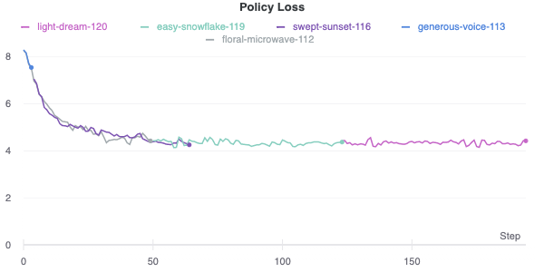
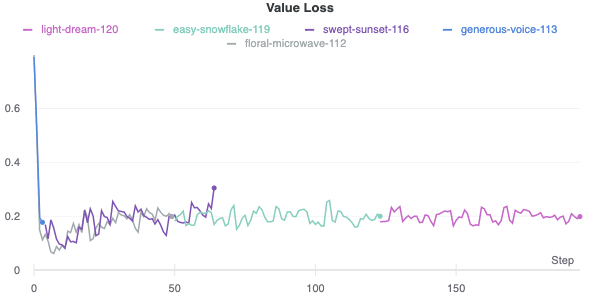

<link rel="stylesheet" type="text/css" href="assets/css/custom.css" />

## Arvind Krishnakumar, Geordan Gutow

&nbsp;
&nbsp;

<!-- |  |
|:--:|
| *Settlers of Catan Game UI* | -->

## Introduction

As part of this project, we developed an AI agent to play the game of Reconnaissance Blind Multi-Chess (RBMC) by learning to play against Stockfish.

RBMC is a variant of chess where the player does not have ability to see the opponent's pieces but have the ability to "sense" a 3x3 grid on the board and retrieve its true state before playing a move. 

## Summary

We developed a modular agent in two parts.

The first part reasons about the board state: the collection of possible boards is updated based on the results of the opponent's move at the beginning of the agent's turn. Then, it selects a sense location to achieve the maximum expected reduction in number of boards. The assumed probability distribution is uniform across the collection. Testing found that this strategy was slightly more effective than choosing the sense that minimized the number of remaining boards in the worst case, while both strategies resulted in an order of magnitude fewer boards than heuristic strategies. Finally, the result of the agent's move is used to eliminate impossible boards. This is the Observer class in the GameState.py file.

The second part of the agent utilizes a neural network trained to return a probability distribution over actions and a value estimate for a single chess board. The approach involves evaluating the agent on some or all of the boards, and then combining the results. The high level agent is encoded in our agent file, while network and MCTS code is in the alphaZero folder.

We use an 18x8x8 representation of the board state. The first 12 channels represent the position of the different pieces, and the remaining channels represent the current turn, ability to castle and ability to capture en passant. The network resembles that used by AlphaZero, with 2 convolutional layers, followed by 10 residual layers, and an output layer that outputs both a value estimate for the current board and a probability distribution over possible actions as a 4273-length linear embedding that encodes all possible actions on a chess board, along with promotions and a None move.

### Playing the game

The first step while running inference using our agent is to check every board for winning moves; there is no need to ask the network about boards that have one. Additionally, the agent is able to determine if there is a single move that, with the rules of blind chess related to sliding moves, will result in taking the enemy king on every board. If there is, it just returns that action rather than using the network. Boards without winning moves are unsolved and need to be analyzed. 

During startup, the agent times how long it takes to analyze a board, so during each turn it computes how many boards it has time to analyze and randomly samples boards from the collection. We implemented a several strategies for picking moves and combining them across boards. The fastest way to get a move for a single board (allowing us to analyze more boards) is to use the network policy output directly. Alternate approaches involved performing proper MCTS guided by the network, with or without an augmentation of the value function via Stockfish analysis. Once a distribution over actions is obtained for each board, we can combine those policies by computing the most likely action in each state, and then choosing the most common best action. Alternatively, we can average the action distributions and then sample from that distribution (or select the most likely action). The submitted agent uses MCTS with 100 sims (and no Stockfish), picks the most likely action for each board, and combines actions by picking the most common action. 

The neural network was NOT trained using self-play. Instead, the network (using MCTS with 1600 simulations as in [Silver et al.](https://arxiv.org/pdf/1712.01815.pdf)) played against Stockfish (using 1 second per move), then updated based on actions from both sides. Games (and simulations) ended with a win by one side, or by draw via any draw rule (except three-fold repetition). In a change from true chess rules, a null move was allowed unless the current player was in check.

## Takeaways

Coming up with a reasonable probabilistic opponent model is very hard, and probably deserved more attention than we gave it. We decided early on to not really have an opponent model because we couldn't come up with a reasonable one, with the result being that we treated every board state as being equally likely (even if there were multiple paths to it). Better weighting on the likelihood of board states would probably have helped reduce the number of boards and improved our ability to win (though not necessarily against random).

In general, this project reinforced that reasoning about uncertainty is just really computationally expensive. The performance difference from using a better observation strategy was stark, because it was pretty much impossible to analyze every board state that MIGHT exist. Keeping the set as small as possible reduced the chances of not analyzing the true board state and missing something important. Similarly, we elected to forego "smart" strategies that integrate sensing and moving, since there wasn't enough compute to systematically analyze moves conditioned on a single sense, let alone more than one.

Self-play reinforcement learning requires tons of data just to get to a minimum level of competence. We went with playing against Stockfish because we found that the self-play games just were not ending, since the network didn't understand how to win a game. Additionally, a game that ends in a draw doesn't provide much in the way of information to learn from. These facts combined to make initial learning extremely slow. Playing against Stockfish helped improve training time (since games ended quickly), as well as network performance (since games were of higher quality, at least from one player). Our best model right now, as shown in Figure \ref{fig:loss}, has been training for about a week on example moves from an agent that plays 10 games in parallel each training iteration, with similar hyperparameters that AlphaGo Zero used. However, it still hasn't learnt to capture an opponent piece definitively. We suspect a lot more training is required for the agent to reach a competent state.

Initially, we implemented a regular MCTS tree search where we would run a rollout against any new state that was encountered to try and reach a terminal state. We would then backpropagate values to all the nodes based on rewards from this state. However, reaching terminal states in the game of chess seemed to take a really long time, and we switched approaches to implement the method adopted by AlphaZero where each simulation proceeds by selecting at each state, a move a with low visit count, high move probability and high value according to the current neural network, which is then backpropagated up the tree. We use a modified [UCB score](https://web.stanford.edu/~surag/posts/alphazero.html) to determine the best action to be taken from a state.

One thing that might have been interesting to explore is the idea that a value function is a much less complicated function than a policy. The latest version of Stockfish uses a tiny neural network to represent its evaluation function; perhaps if we had foregone a policy network and simply tried to train a value network for use in Alpha-Beta search, we would have had more success in training (since smaller networks need less data). However that didn't seem to be in the spirit of the rules.

| {:height="300px" width="600px"} |
|:--:|
| *Policy Loss vs Steps* |

---

| {:height="300px" width="600px"} |
|:--:|
| *Value Loss vs Steps* |

---

&nbsp;

## References

- Mastering Chess and Shogi by Self-Play with a General Reinforcement Learning Algorithm: https://arxiv.org/pdf/1712.01815.pdf

- Strangefish: https://github.com/ginop/reconchess-strangefish

- Simple AlphaZero: https://web.stanford.edu/~surag/posts/alphazero.html

## Individual Contributions

**Geordan:** I handled the reasoning about uncertainty aspects of the agent. I designed the sensing strategy based on the approach used by [Strangefish](https://github.com/ginop/reconchess-strangefish). However, Strangefish used a more complicated strategy that tried to estimate how impactful the sense result would be on the move it would decide on, something we decided was not computationally feasible for us. Furthermore, the board reduction component of their strategy was actually implemented wrong. I also wrote the observer that uses information about move results to update the set of possible boards and the various agent level strategies used to leverage the neural network's chess playing to play RBMC. I wrote the code to determine if the current set of boards admits a single guaranteed win move. I also augmented the MCTS with the ability to recognize when a state has been reached along multiple paths, allowing it to backpropagate information gained in previous simulations. Finally, I ran hundreds of games of our agent against random in debug mode to identify and fix edge cases, as well as to compare the effectiveness of various strategies. 

**Arvind:** My contributions involved implementing the AlphaZero-inspired approach of using a neural network in combination with MCTS to learn how to the play the game of regular chess. We eliminate the partial observability from this part of the agent, and use the true state as determined by the "sense" module as input to the network. As part of this process, I first had to convert any given board state into a standard format and design a neural network to output a probability distribution over actions. This output distribution is then masked with legal actions and renormalized to determine the best action to be taken from the current board state. I implemented MCTS for running a specified number of simulations before determining the best action to take at every turn based on the highest UCB score. I spent a good portion of time debugging corner cases, and invalid board states as this would lead to crashes in training. I also ran hundreds of runs against different hyperparameters to train our network to perform better. 